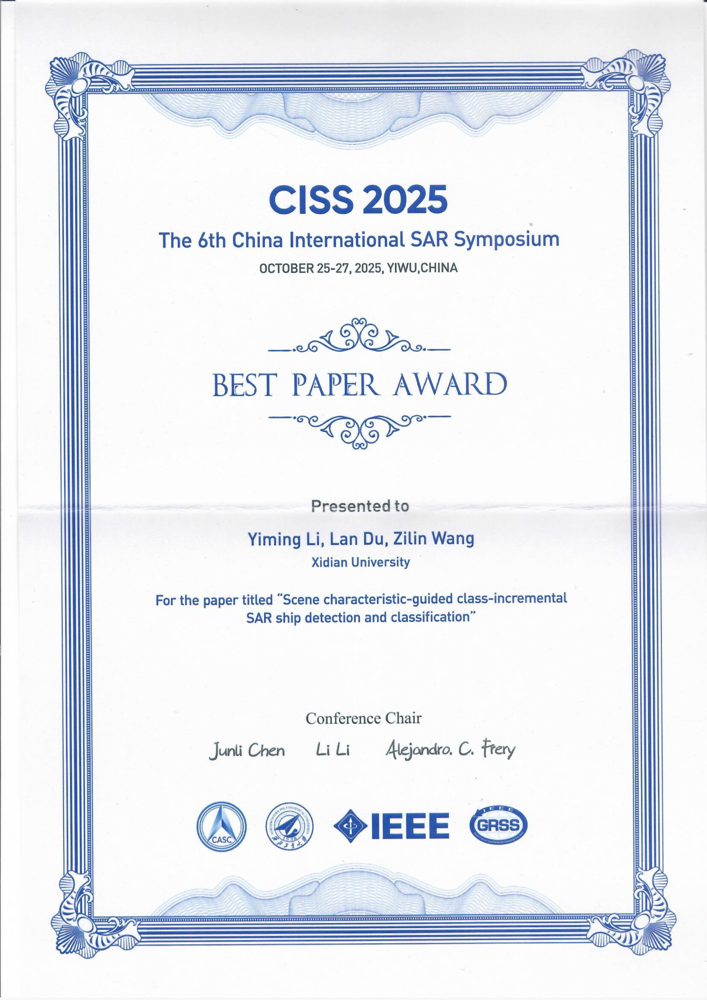

实验室李逸明同学在2025年第6届中国国际SAR研讨会的论文被接受。
其论文《Scene Characteristic-Guided Class-Incremental SAR Ship Detection and Classification》
针对雷达目标持续学习方法在缓解灾难性遗忘方面的不足，合理挖掘目标的场景特性并嵌入到数据回放与知识蒸馏过程，更新后的模型性能高于基准方法。

<!--more-->

</img>
